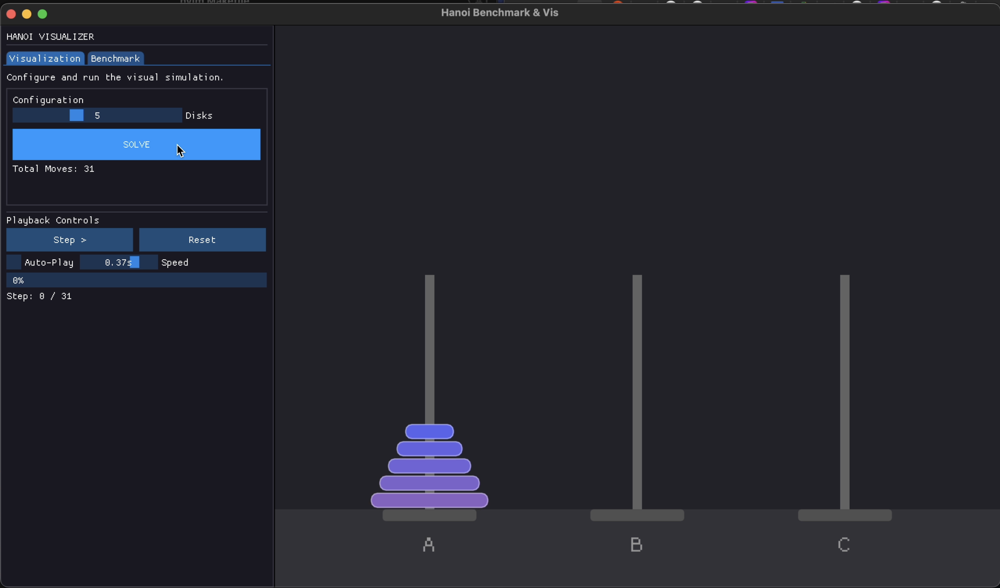

# Towers of Hanoi: Visualization & Benchmark

A high-performance C++ application that visualizes the Towers of Hanoi algorithm and benchmarks the performance difference between **Recursive** and **Iterative** solutions. Built using **C++17**, **OpenGL**, and **ImGui**.

## 🎥 Demo

*(To add a demo: Take a screenshot of the running application, rename it to `screenshot.png`, and place it inside the `demo/` folder in your project root.)*

## 🚀 Features

* **Interactive Visualization:**
    * Watch the algorithm solve the puzzle step-by-step.
    * Control playback speed, pause, step forward, and reset.
    * **Toggle Algorithms:** Switch between Recursive and Iterative solutions visually.
    * Modern, dark-themed UI with a split-screen layout (Sidebar + Game View).
* **Performance Benchmarking:**
    * Run performance tests on large datasets ($N$ disks).
    * Compare execution time (ms) between Iterative and Recursive approaches.
    * Export results to CSV (`hanoi_results.csv`) for analysis.
* **Cross-Platform Core:**
    * Supports macOS (OpenGL 3.2 Core Profile) and Linux/Windows (OpenGL 3.0).

## 🛠️ Prerequisites

You need a C++ compiler (supporting C++17) and the **GLFW** library installed.

